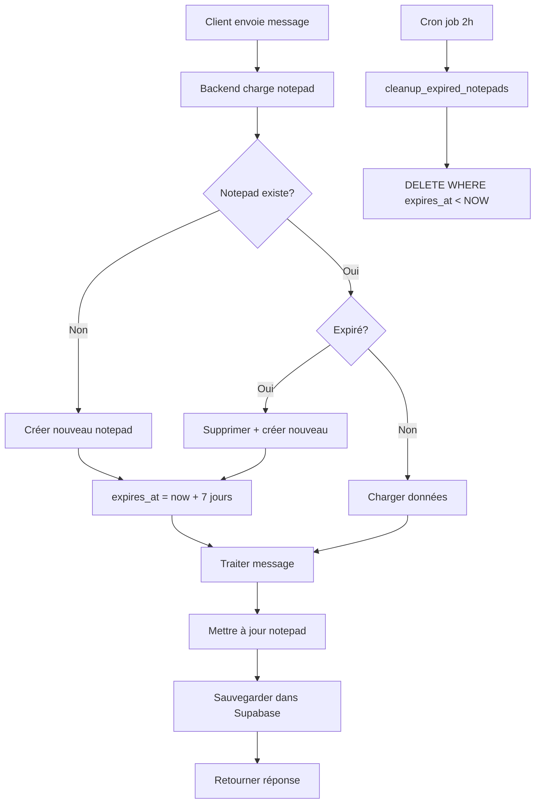

# 🔒 MIGRATION NOTEPAD → SUPABASE (Sécurisé + Auto-Cleanup)

## 📋 **RÉSUMÉ**

Migration du système de notepad **RAM → Supabase** pour :
- ✅ **Persistance** : Données conservées même après redémarrage serveur
- ✅ **Sécurité** : RLS activé, données liées à `user_id`
- ✅ **Auto-cleanup** : Suppression automatique après 7 jours
- ✅ **Multi-instance** : Fonctionne avec plusieurs serveurs backend

---

## 🗄️ **ARCHITECTURE**

### **Avant (RAM)**
```python
# ❌ Problèmes
class ConversationNotepad:
    def __init__(self):
        self.notepads: Dict[str, Dict] = {}  # En mémoire RAM
        
# Conséquences:
# - Données perdues au redémarrage
# - Pas de cleanup automatique
# - Pollution mémoire
# - Pas de sécurité RLS
```

### **Après (Supabase)**
```python
# ✅ Solution
class SupabaseNotepad:
    async def get_notepad(self, user_id, company_id):
        # Charge depuis Supabase
        # Auto-vérifie expiration
        # Retourne données sécurisées
        
# Avantages:
# - Persistance garantie
# - Auto-expiration 7 jours
# - RLS activé (sécurité)
# - Scalable multi-instance
```

---

## 🚀 **ÉTAPES DE MIGRATION**

### **Étape 1 : Créer la table Supabase**

1. Ouvrir **Supabase Dashboard** : https://ilbihprkxcgsigvueeme.supabase.co
2. Aller dans **SQL Editor**
3. Copier-coller le contenu de `database/create_conversation_notepad_table.sql`
4. Exécuter le script

**Vérification** :
```sql
-- Vérifier que la table existe
SELECT * FROM public.conversation_notepad LIMIT 1;

-- Vérifier les index
SELECT indexname FROM pg_indexes WHERE tablename = 'conversation_notepad';

-- Vérifier RLS activé
SELECT tablename, rowsecurity FROM pg_tables WHERE tablename = 'conversation_notepad';
```

---

### **Étape 2 : Configurer le cron job (cleanup automatique)**

**Option A : Supabase pg_cron (recommandé)**

Dans l'éditeur SQL Supabase :
```sql
-- Activer l'extension pg_cron
CREATE EXTENSION IF NOT EXISTS pg_cron;

-- Planifier cleanup quotidien à 2h du matin
SELECT cron.schedule(
    'cleanup-expired-notepads',
    '0 2 * * *',  -- Tous les jours à 2h
    $$ SELECT cleanup_expired_notepads(); $$
);

-- Vérifier le cron job
SELECT * FROM cron.job;
```

**Option B : Cron système (alternative)**

Sur le serveur backend :
```bash
# Éditer crontab
crontab -e

# Ajouter cette ligne (cleanup quotidien à 2h)
0 2 * * * cd /path/to/chatbot/CHATBOT2.0 && python scripts/cleanup_expired_notepads.py >> logs/cleanup.log 2>&1
```

---

### **Étape 3 : Tester la migration**

**Test 1 : Création notepad**
```python
from core.supabase_notepad import get_supabase_notepad
import asyncio

async def test_create():
    notepad = get_supabase_notepad()
    data = await notepad.get_notepad("test_user_123", "W27PwOPiblP8TlOrhPcjOtxd0cza")
    print(f"Notepad créé: {data}")

asyncio.run(test_create())
```

**Test 2 : Mise à jour**
```python
async def test_update():
    notepad = get_supabase_notepad()
    data = await notepad.get_notepad("test_user_123", "W27PwOPiblP8TlOrhPcjOtxd0cza")
    
    # Modifier
    data['delivery_zone'] = 'Cocody'
    data['phone_number'] = '0787360757'
    
    # Sauvegarder
    success = await notepad.update_notepad("test_user_123", "W27PwOPiblP8TlOrhPcjOtxd0cza", data)
    print(f"Mise à jour: {success}")

asyncio.run(test_update())
```

**Test 3 : Vérifier dans Supabase**
```sql
-- Voir tous les notepads
SELECT 
    user_id, 
    company_id, 
    data->>'delivery_zone' as zone,
    data->>'phone_number' as phone,
    created_at,
    expires_at
FROM public.conversation_notepad
ORDER BY created_at DESC;
```

**Test 4 : Cleanup manuel**
```python
async def test_cleanup():
    notepad = get_supabase_notepad()
    deleted = await notepad.cleanup_expired_notepads()
    print(f"Notepads supprimés: {deleted}")

asyncio.run(test_cleanup())
```

---

## 🔐 **SÉCURITÉ RLS**

### **Politiques appliquées**

```sql
-- 1. SELECT : Utilisateur voit uniquement ses données
CREATE POLICY "Users can view own notepad"
    ON public.conversation_notepad
    FOR SELECT
    USING (auth.uid()::text = user_id OR auth.role() = 'service_role');

-- 2. INSERT : Utilisateur crée uniquement pour lui-même
CREATE POLICY "Users can insert own notepad"
    ON public.conversation_notepad
    FOR INSERT
    WITH CHECK (auth.uid()::text = user_id OR auth.role() = 'service_role');

-- 3. UPDATE : Utilisateur modifie uniquement ses données
CREATE POLICY "Users can update own notepad"
    ON public.conversation_notepad
    FOR UPDATE
    USING (auth.uid()::text = user_id OR auth.role() = 'service_role');

-- 4. DELETE : Utilisateur supprime uniquement ses données
CREATE POLICY "Users can delete own notepad"
    ON public.conversation_notepad
    FOR DELETE
    USING (auth.uid()::text = user_id OR auth.role() = 'service_role');
```

### **Bypass RLS (Service Role)**

Le backend utilise `SUPABASE_SERVICE_KEY` qui **bypass RLS** :
- ✅ Permet au backend de gérer tous les notepads
- ✅ Nécessaire pour cleanup automatique
- ⚠️ **NE JAMAIS** exposer cette clé côté client

---

## 📊 **STRUCTURE DONNÉES**

### **Table `conversation_notepad`**

| Colonne | Type | Description |
|---------|------|-------------|
| `id` | UUID | Clé primaire (auto-généré) |
| `user_id` | TEXT | ID utilisateur (peut être anonyme ou lié à `auth.users`) |
| `company_id` | TEXT | ID entreprise (compatible `company_rag_configs`) |
| `data` | JSONB | Données notepad (voir structure ci-dessous) |
| `created_at` | TIMESTAMP | Date création |
| `updated_at` | TIMESTAMP | Date dernière modification (auto-update) |
| `expires_at` | TIMESTAMP | Date expiration (`created_at + 7 jours`) |

### **Structure `data` (JSONB)**

```json
{
  "created_at": "2025-11-10T09:00:00",
  "products": [],
  "quantities": [],
  "delivery_zone": "Cocody",
  "delivery_cost": "1500",
  "payment_method": "Wave",
  "payment_number": "+225 0787360757",
  "phone_number": "0787360757",
  "photo_produit": "Détecté: diaper package",
  "paiement": {
    "montant": 2020,
    "validé": true
  },
  "calculated_totals": {},
  "last_updated": "2025-11-10T09:30:00",
  "conversation_count": 5,
  "last_product_mentioned": "Couches M"
}
```

---

## 🔄 **CYCLE DE VIE**



---

## 📈 **MONITORING**

### **Requêtes utiles**

```sql
-- 1. Nombre total de notepads actifs
SELECT COUNT(*) FROM public.conversation_notepad WHERE expires_at > NOW();

-- 2. Notepads par entreprise
SELECT 
    company_id, 
    COUNT(*) as total,
    MIN(created_at) as plus_ancien,
    MAX(updated_at) as plus_recent
FROM public.conversation_notepad
WHERE expires_at > NOW()
GROUP BY company_id;

-- 3. Notepads qui vont expirer dans 24h
SELECT 
    user_id,
    company_id,
    expires_at,
    AGE(expires_at, NOW()) as temps_restant
FROM public.conversation_notepad
WHERE expires_at BETWEEN NOW() AND NOW() + INTERVAL '24 hours'
ORDER BY expires_at;

-- 4. Taille moyenne des données
SELECT 
    AVG(pg_column_size(data)) as avg_size_bytes,
    MAX(pg_column_size(data)) as max_size_bytes
FROM public.conversation_notepad;

-- 5. Activité par jour
SELECT 
    DATE(created_at) as jour,
    COUNT(*) as nouveaux_notepads
FROM public.conversation_notepad
WHERE created_at > NOW() - INTERVAL '30 days'
GROUP BY DATE(created_at)
ORDER BY jour DESC;
```

---

## ⚠️ **IMPORTANT PRODUCTION**

### **Avant mise en production**

1. ✅ **Régénérer les clés Supabase** (actuellement en TEST)
2. ✅ **Configurer variables d'environnement** :
   ```bash
   export SUPABASE_URL="https://YOUR_PROJECT.supabase.co"
   export SUPABASE_SERVICE_KEY="YOUR_SERVICE_ROLE_KEY"
   ```
3. ✅ **Tester le cron job** de cleanup
4. ✅ **Configurer alertes** si cleanup échoue
5. ✅ **Backup régulier** de la table (optionnel)

### **Limites Supabase**

- **Free tier** : 500 MB stockage, 2 GB bande passante/mois
- **Pro tier** : 8 GB stockage, 50 GB bande passante/mois
- **Estimation** : 1 notepad ≈ 2-5 KB → ~100 000 notepads dans Free tier

---

## 🎯 **RÉSUMÉ MIGRATION**

| Aspect | Avant (RAM) | Après (Supabase) |
|--------|-------------|------------------|
| **Persistance** | ❌ Perdu au redémarrage | ✅ Permanent |
| **Sécurité** | ❌ Aucune | ✅ RLS activé |
| **Cleanup** | ❌ Manuel | ✅ Auto 7 jours |
| **Multi-instance** | ❌ Incompatible | ✅ Compatible |
| **Scalabilité** | ❌ Limité RAM | ✅ Illimité |
| **Audit** | ❌ Impossible | ✅ Logs Supabase |

---

## ✅ **CHECKLIST DÉPLOIEMENT**

- [ ] Script SQL exécuté dans Supabase
- [ ] Table `conversation_notepad` créée
- [ ] Index créés
- [ ] RLS activé et testé
- [ ] Cron job configuré (pg_cron ou système)
- [ ] Tests unitaires passés
- [ ] Variables d'environnement configurées
- [ ] Clés Supabase régénérées (production)
- [ ] Monitoring configuré
- [ ] Documentation équipe mise à jour

---

**Migration complète ! Le notepad est maintenant sécurisé et persistant dans Supabase avec auto-cleanup 7 jours.** 🎉
