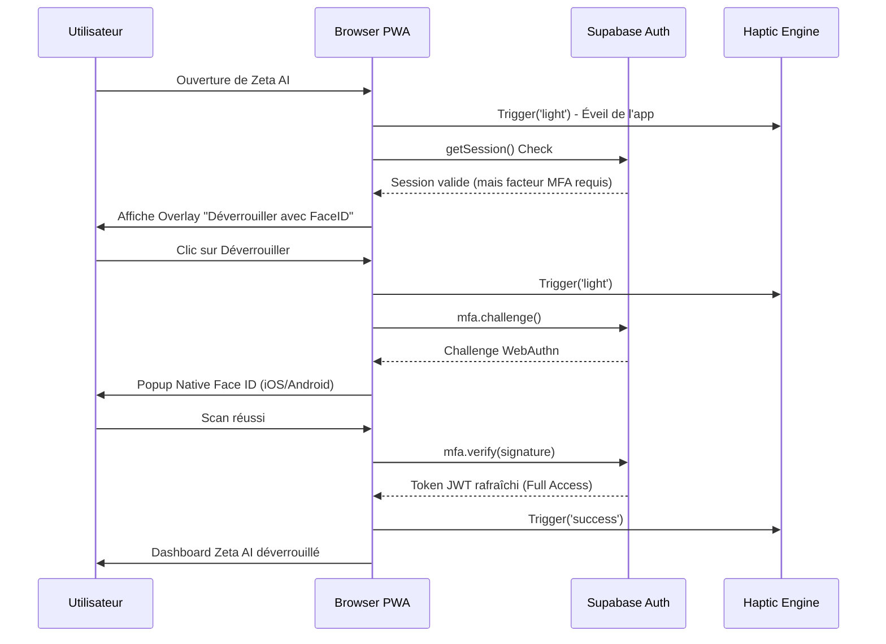

# Cartographie & Analyse Stratégique : Zeta AI Elite Layer

Ce document détaille l'emplacement, la justification technique et le fonctionnement simulé des nouvelles fonctionnalités PWA Premium pour Zeta AI 2026.

---

## 🗺️ Cartographie de l'Expérience Utilisateur

| Zone de l'App | Fonctionnalité | Action Déclenchée | Justification (Le Pourquoi) | Pourquoi pas ailleurs ? |
| :--- | :--- | :--- | :--- | :--- |
| **Login / Startup** | **Passkeys / FaceID** | Challenge biométrique immédiat | Sécurité native sans friction. 0 mot de passe à taper. | On ne met pas d'auth sur chaque clic, seulement à l'ouverture ou actions sensibles. |
| **Boutons (Global)** | **Micro-Haptique (Light)** | Vibration de 10ms au `onClick` | Donner une "consistance physique" aux pixels. Effet mécanique. | On évite le haptique sur le scroll ou les hovers pour ne pas saturer l'utilisateur. |
| **Toasts / Modales** | **Feedback Haptique** | Success (Double) / Error (Triple) | Confirmation sensorielle du résultat d'une action. | Limité aux feedbacks critiques pour garder l'effet de surprise et de qualité. |
| **Navigation Page** | **View Transitions** | Morphing fluide entre vues | Fluidité visuelle digne d'une app iOS native. | Utile uniquement sur les changements de contexte majeurs (ex: Dashboard -> Catalogue). |
| **Reçus Wave** | **Pull-to-Refresh** | Vibration au point de rupture | Sensation que l'app "décroche" physiquement pour recharger. | Uniquement sur les listes rafraîchissables par l'utilisateur. |

---

## 🛠️ Simulation du Système : "Le Daily Unlock"

Voici comment les systèmes (Supabase, Navigateur et Haptique) collaborent pour l'expérience quotidienne :

---

## 🧠 Analyse : Pourquoi cette architecture ?

### 1. Le "Quoi" : La couche de micro-haptique
Nous n'utilisons pas la vibration comme une alerte, mais comme une **réponse physique**. Chaque bouton de l'interface doit donner l'impression d'être un bouton physique. 
- **Code** : Centralisé dans `src/services/haptics.ts`.
- **Pourquoi ici ?** Pour garantir une uniformité. Si l'utilisateur clique sur "Valider" ou "Annuler", la vibration doit être identique partout.

### 2. Le "Pourquoi" de FaceID/Passkey
Le plus grand frein aux PWAs est la reconnexion quand la session expire. 
- **Le Quoi** : Utilisation du Passkey stocké dans le Secure Enclave du téléphone.
- **Le Pourquoi** : C'est la technologie la plus sécurisée (anti-phishing) et la plus rapide du marché.
- **Pourquoi pas ailleurs ?** Nous aurions pu utiliser un code PIN interne à l'app, mais c'est moins "Elite" et moins sécurisé que le système natif.

### 3. Simulation Haptique Spécifique (Wave)
Lorsqu'un reçu Wave est détecté :
1. **Visuel** : Le toast apparaît en glissant de haut en bas.
2. **Tactile** : Une vibration `success` synchrone avec l'animation.
3. **Cérébral** : L'utilisateur associe instantanément la sensation physique à la réussite de sa vente.

---

**Cette combinaison fait passer Zeta AI de "Outil de gestion" à "Compagnon Premium".**
